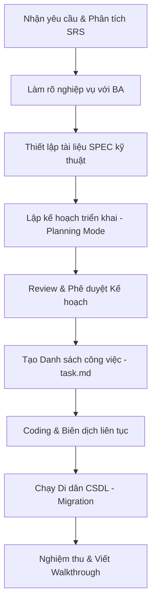

# Quy trình phát triển một tính năng/thay đổi từ tài liệu SRS
## Tài liệu Quy trình Chuẩn (Process Specification)

Tài liệu này đúc kết quy trình chuẩn hóa từ thực tế phát triển dự án, mô tả các bước từ khi nhận yêu cầu nghiệp vụ (SRS) cho đến khi hoàn thành, kiểm thử và bàn giao tính năng. Quy trình này đảm bảo tính nhất quán, khả năng truy vết và độ tin cậy của mã nguồn.

---

## Sơ đồ Quy trình Phát triển (Workflow Diagram)

---

## Chi tiết các bước thực hiện

### Bước 1: Phân tích tài liệu Nghiệp vụ (SRS Phase)
*   **Mục tiêu:** Hiểu rõ mục đích, phạm vi, khái niệm cốt lõi và các quy tắc hệ thống của tính năng mới.
*   **Hành động:** 
    *   Đọc hiểu sâu tài liệu nghiệp vụ ban đầu.
    *   Đặt ra các câu hỏi phản biện kỹ thuật để làm rõ các điểm mơ hồ (ví dụ: cơ chế khóa dữ liệu lịch sử, tính độc nhất của mã vạch, thuật toán tự động tính giá vốn/giá bán,...).
*   **Kết quả:** Tài liệu SRS chuẩn hóa lưu tại thư mục `\srs` (Ví dụ: `srs/SRS_Product_UOM_Conversion.md`).

### Bước 2: Thiết lập Đặc tả Kỹ thuật (SPEC Phase)
*   **Mục tiêu:** Ánh xạ các quy tắc nghiệp vụ thành các thay đổi cụ thể trên mã nguồn hiện tại của dự án.
*   **Hành động:**
    *   Phân tích cấu trúc thư mục, tệp tin hiện tại (Backend Entities, Services, Controllers, DTOs, Mappings cho tới Frontend Types, Components).
    *   Xác định rõ các tệp cần **Thêm mới [NEW]**, **Sửa đổi [MODIFY]** hoặc **Xóa bỏ [DELETE]**.
*   **Kết quả:** Tài liệu SPEC lưu tại thư mục `\spec` (Ví dụ: `spec/SPEC_Product_UOM_Conversion.md`).

### Bước 3: Lập Kế hoạch Triển khai (Planning Mode)
*   **Mục tiêu:** Cung cấp cho khách hàng/quản trị dự án cái nhìn tổng quan về tác động kiến trúc và kế hoạch thực hiện để phê duyệt.
*   **Hành động:**
    *   Tạo tệp `implementation_plan.md` trong thư mục workspace/artifact của AI.
    *   Liệt kê: Tóm tắt mục tiêu, các thay đổi kiến trúc cần chú ý (User Review Required), các câu hỏi mở (nếu có), chi tiết file thay đổi và Kế hoạch xác thực (Verification Plan).
*   **Kết quả:** Tệp `implementation_plan.md` được phê duyệt bởi người dùng trước khi tiến hành code.

### Bước 4: Tạo Danh sách công việc (Tasks Checklist)
*   **Mục tiêu:** Quản lý tiến độ triển khai một cách khoa học theo từng cụm công việc nhỏ.
*   **Hành động:**
    *   Tạo tệp `task.md` chứa danh sách công việc.
    *   Phân rã thành: Thay đổi DB/Entity -> DTOs & Mappings -> Logic Nghiệp vụ (Backend Services) -> Giao diện (Frontend) -> Kiểm thử.
    *   Cập nhật trạng thái liên tục trong quá trình làm việc: `[ ]` (chưa làm), `[/]` (đang làm), `[x]` (đã làm).
*   **Kết quả:** File `task.md` phản ánh chính xác tiến độ thực tế.

### Bước 5: Thực hiện Code & Biên dịch liên tục (Implementation & Build)
*   **Mục tiêu:** Viết code sạch, đúng nghiệp vụ và đảm bảo hệ thống không bị lỗi biên dịch.
*   **Hành động:**
    *   Viết code theo thứ tự từ dưới lên (Dependencies first): Database Entity -> DTOs -> Services -> UI Components.
    *   **Áp dụng Migration:** Chạy lệnh tạo migration và cập nhật database (`dotnet ef database update`) ngay sau khi hoàn tất phần Entity & DbContext.
    *   **Build & Check type liên tục:** Chạy `dotnet build` (cho Backend) và `tsc --noEmit` (cho Frontend) ở mỗi bước hoàn thành để phát hiện sớm các lỗi cú pháp.

### Bước 6: Nghiệm thu & Viết báo cáo hoàn thành (Walkthrough & QA)
*   **Mục tiêu:** Bàn giao tính năng kèm theo bằng chứng xác thực chạy ổn định và tài liệu hướng dẫn nghiệm thu thủ công cho QA/Khách hàng.
*   **Hành động:**
    *   Tạo tệp `walkthrough.md` tổng hợp toàn bộ các file đã sửa, kết quả chạy build/test.
    *   Cung cấp **Hướng dẫn nghiệm thu thủ công (Manual Verification Guide)** với các kịch bản test cụ thể (Test cases) từng bước để người dùng dễ dàng chạy thử.
*   **Kết quả:** File `walkthrough.md` được bàn giao, các tác vụ trong `task.md` được đánh dấu hoàn thành 100%.
