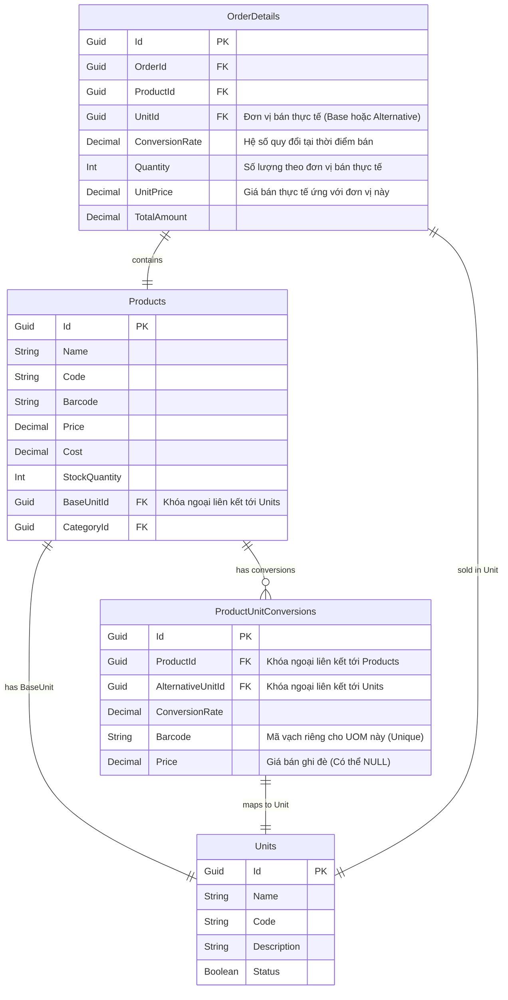

# Tài liệu Yêu cầu Nghiệp vụ Phần mềm (SRS)
## Tính năng: Quy đổi Đơn vị tính Sản phẩm (Product Unit of Measure Conversion)

Tài liệu này mô tả chi tiết các yêu cầu nghiệp vụ, quy tắc hệ thống, thiết kế cơ sở dữ liệu và mô tả chức năng cho tính năng quản lý và quy đổi đơn vị tính (UOM) thuộc phân hệ Quản lý Sản phẩm và Bán hàng (POS).

---

## 1. Giới thiệu & Phạm vi (Introduction & Scope)

### 1.1. Mục đích
Tính năng quy đổi đơn vị tính cho phép hệ thống bán hàng và quản lý kho vận hành linh hoạt với nhiều đơn vị đo lường khác nhau trên cùng một sản phẩm (ví dụ: nhập/bán theo Thùng, Lốc nhưng quản lý tồn kho theo Lon). Tính năng này giúp tối ưu hóa thao tác bán sỉ/bán lẻ, đồng thời đảm bảo số liệu tồn kho luôn được chuẩn hóa và chính xác.

### 1.2. Phạm vi ảnh hưởng
*   **Phân hệ Sản phẩm:** Thiết lập đơn vị cơ bản và danh sách các đơn vị quy đổi kèm hệ số, giá bán ghi đè, mã vạch riêng.
*   **Phân hệ Bán hàng (POS):** Chọn đơn vị tính khi tạo đơn hàng, quét barcode tự động nhận dạng đơn vị tính, kiểm tra tồn kho theo đơn vị quy đổi.
*   **Phân hệ Kho:** Trừ/hoàn tồn kho theo lượng quy đổi thực tế.
*   **Phân hệ Báo cáo:** Báo cáo chi tiết theo đơn vị bán thực tế; báo cáo tổng hợp quy đổi về đơn vị tính cơ bản.

---

## 2. Khái niệm Cốt lõi (Core Concepts)

*   **Đơn vị tính cơ bản (Base Unit):** Là đơn vị đo lường nhỏ nhất của sản phẩm dùng để quản lý tồn kho. Mọi giao dịch phát sinh sẽ được quy đổi về đơn vị này để lưu trữ và tính toán tồn kho.
*   **Đơn vị tính quy đổi (Alternative Unit):** Là các đơn vị tính lớn hơn hoặc khác biệt (ví dụ: Hộp, Lốc, Thùng, Pallet...) dùng trong giao dịch mua/bán hoặc kiểm kho.
*   **Hệ số quy đổi (Conversion Rate):** Tỷ lệ quy đổi toán học thể hiện một Đơn vị quy đổi bằng bao nhiêu lần Đơn vị cơ bản (ví dụ: 1 Thùng = 24 Lon -> Hệ số là 24).
*   **Giá bán ghi đè (Price Override):** Giá bán thiết lập riêng cho đơn vị quy đổi. Nếu không thiết lập, hệ thống tự tính toán theo hệ số quy đổi ($Giá cơ bản \times Hệ số$).

---

## 3. Quy tắc Nghiệp vụ (Business Rules - BR)

| Mã BR | Tên Quy tắc | Mô tả chi tiết |
| :--- | :--- | :--- |
| **BR-01** | **Khóa Đơn vị Cơ bản** | Mỗi sản phẩm bắt buộc có một Đơn vị tính cơ bản duy nhất. Hệ thống sẽ **khóa, không cho phép thay đổi Đơn vị tính cơ bản** nếu sản phẩm đó đã phát sinh bất kỳ giao dịch nào trong lịch sử (tồn tại ID sản phẩm trong các bảng như `OrderDetails`, `InventoryTransactions`,...). Không phụ thuộc vào tồn kho hiện tại bằng hay khác 0. |
| **BR-02** | **Hệ số Quy đổi hợp lệ** | Hệ số quy đổi của Đơn vị quy đổi bắt buộc phải là một số lớn hơn 0 ($> 0$). |
| **BR-03** | **Không trùng lặp đơn vị** | Một sản phẩm có thể cấu hình không giới hạn số lượng Đơn vị tính quy đổi, nhưng các đơn vị này không được trùng lặp nhau trên cùng một sản phẩm. Đơn vị quy đổi phải được chọn từ Danh mục Đơn vị tính hệ thống (Units Master Data), không nhập tự do (free text). |
| **BR-04** | **Tính duy nhất của Mã vạch** | Mã vạch định danh cho mỗi Đơn vị quy đổi (nếu có) phải là **duy nhất (unique) trên toàn bộ hệ thống** (không trùng giữa các sản phẩm khác nhau hoặc giữa các đơn vị tính của cùng một sản phẩm). |
| **BR-05** | **Quét và Nhận diện Barcode** | Tại màn hình bán hàng/giao dịch, khi người dùng quét mã vạch, hệ thống tự động tìm và điền thông tin: Sản phẩm, Đơn vị tính tương ứng với mã vạch đó và mặc định số lượng là 1. |
| **BR-06** | **Thiết lập Đơn giá & Giá vốn** | - **Giá bán (Selling Price):** Cho phép thiết lập và ghi đè giá bán riêng cho từng đơn vị quy đổi. Nếu không ghi đè, giá bán = $Giá cơ bản \times Hệ số$.\\n- **Giá vốn (Cost Price):** Không cho phép ghi đè giá vốn tĩnh trên đơn vị quy đổi. Giá vốn của đơn vị quy đổi luôn được tự động tính toán bằng: $Giá vốn cơ bản \times Hệ số$. |
| **BR-07** | **Trừ/Hoàn tồn kho** | Số lượng trừ kho thực tế luôn được tính theo đơn vị cơ bản:\\n$\text{Số lượng trừ kho} = \text{Số lượng giao dịch} \times \text{Hệ số quy đổi}$.\\nKhi hủy đơn hàng, số lượng hoàn trả vào kho cũng được tính tương tự. |

---

## 4. Thiết kế Cơ sở dữ liệu (Database Schema Design)

### 4.1. Thực thể và Mối quan hệ (Entity Relationship)

### 4.2. Chi tiết các bảng thay đổi/thêm mới

#### Bảng `Products` (Cập nhật)
*   Đổi tên trường/Khóa ngoại `UnitId` thành `BaseUnitId` để làm rõ đây là Đơn vị cơ bản của sản phẩm.

#### Bảng `ProductUnitConversions` (Thêm mới)
Lưu trữ thông tin quy đổi đơn vị tính của từng sản phẩm.
*   `Id` (Guid, Primary Key): Khóa chính.
*   `ProductId` (Guid, Foreign Key): Liên kết tới bảng `Products`.
*   `AlternativeUnitId` (Guid, Foreign Key): Liên kết tới bảng `Units`.
*   `ConversionRate` (Decimal(18,4)): Hệ số quy đổi so với đơn vị tính cơ bản. Bắt buộc $> 0$.
*   `Barcode` (Varchar(50), Nullable): Mã vạch riêng cho đơn vị này (Unique toàn hệ thống).
*   `Price` (Decimal(18,2), Nullable): Giá bán ghi đè cho đơn vị quy đổi. Nếu `NULL`, hệ thống tự tính dựa trên giá cơ bản và hệ số.

#### Bảng `OrderDetails` (Cập nhật)
*   Thêm `UnitId` (Guid, Foreign Key): Đơn vị tính được chọn khi đặt mua.
*   Thêm `ConversionRate` (Decimal(18,4)): Hệ số quy đổi tại thời điểm bán để phục vụ lưu vết lịch sử và chạy báo cáo.

---

## 5. Yêu cầu Chức năng (Functional Requirements)

### 5.1. Quản lý Sản phẩm (Product Management)
*   **Chức năng thiết lập đơn vị quy đổi:**
    *   Cho phép người dùng thêm nhiều dòng đơn vị quy đổi cho một sản phẩm.
    *   Dropdown chọn Đơn vị quy đổi từ danh mục `Units` có sẵn. Hệ thống tự động loại trừ Đơn vị cơ bản và các đơn vị đã chọn trước đó khỏi danh sách chọn để tránh trùng lặp.
    *   Nhập hệ số quy đổi, mã vạch riêng, và giá bán ghi đè.
*   **Ràng buộc kiểm tra trước khi lưu:**
    *   Hệ thống kiểm tra tính duy nhất của trường `Barcode` trên cả hai bảng `Products` và `ProductUnitConversions`. Nếu trùng, báo lỗi và chặn lưu.
    *   Kiểm tra nếu sản phẩm đã tồn tại trong lịch sử giao dịch bán hàng (`OrderDetails`), hệ thống sẽ khóa (disable) dropdown chọn Đơn vị tính cơ bản (`BaseUnitId`) trên màn hình chỉnh sửa sản phẩm.

### 5.2. Màn hình Bán hàng (POS / Checkout)
*   **Dropdown Đơn vị tính:**
    *   Tại mỗi dòng sản phẩm trong giỏ hàng, hiển thị dropdown cho phép chọn đơn vị tính.
    *   Danh sách chọn gồm: Đơn vị tính cơ bản và các Đơn vị quy đổi đã thiết lập của sản phẩm đó.
    *   Khi thay đổi đơn vị tính, hệ thống tự động tính lại đơn giá của dòng đó:
        *   Nếu đơn vị được chọn có giá bán ghi đè $\rightarrow$ sử dụng giá bán ghi đè.
        *   Nếu không có giá bán ghi đè $\rightarrow$ đơn giá = $Giá cơ bản \times Hệ số$.
*   **Quét Mã vạch (Barcode Scanning):**
    *   Khi người dùng quét mã vạch trên POS:
        *   Nếu mã vạch khớp với mã vạch của sản phẩm (Base Unit) $\rightarrow$ Thêm sản phẩm vào giỏ hàng với Đơn vị cơ bản, số lượng cộng thêm 1.
        *   Nếu mã vạch khớp với mã vạch của Đơn vị quy đổi $\rightarrow$ Thêm sản phẩm vào giỏ hàng với Đơn vị quy đổi tương ứng, số lượng cộng thêm 1.
*   **Kiểm tra tồn kho khi thanh toán:**
    *   Quy đổi tổng số lượng của sản phẩm trong giỏ hàng về đơn vị cơ bản:
        $$\text{Tổng yêu cầu cơ bản} = \sum (\text{Số lượng} \times \text{Hệ số})$$
    *   So sánh với số lượng tồn kho hiện tại của sản phẩm (`StockQuantity`). Nếu không đủ hàng, hệ thống đưa ra cảnh báo chi tiết và chặn thanh toán.

### 5.3. Báo cáo hệ thống (Reporting)
*   **Báo cáo chi tiết giao dịch:** Hiển thị nguyên trạng đơn vị tính đã lưu trong `OrderDetails.UnitId` và số lượng giao dịch tương ứng.
*   **Báo cáo Xuất-Nhập-Tồn tổng hợp:** Hệ thống tự động quy đổi toàn bộ số lượng tồn kho, lượng bán, lượng nhập về đơn vị tính cơ bản (`BaseUnitId`) của sản phẩm để hiển thị số liệu đồng nhất.

---

## 6. Kế hoạch xác thực (Verification Plan)

### 6.1. Kiểm thử Tự động (Automated Tests)
*   **Unit Tests:**
    *   Kiểm tra tính toán giá bán đơn vị quy đổi khi có/không có giá ghi đè.
    *   Kiểm tra logic trừ kho khi bán sản phẩm bằng đơn vị quy đổi.
    *   Kiểm tra chặn sửa Đơn vị cơ bản khi sản phẩm đã phát sinh giao dịch.
*   **Integration Tests:**
    *   Kiểm tra tính duy nhất của mã vạch (Barcode) trên toàn bộ hệ thống.

### 6.2. Kiểm thử Thủ công (Manual Verification)
1.  **Thiết lập Sản phẩm:** Tạo sản phẩm "Nước Cola" với đơn vị cơ bản là "Lon", giá bán 10.000đ. Cấu hình đơn vị quy đổi "Thùng", hệ số 24, giá bán ghi đè 220.000đ (thay vì 240.000đ).
2.  **Bán hàng POS:** Chọn sản phẩm "Nước Cola", đổi đơn vị từ "Lon" sang "Thùng", kiểm tra xem giá có tự động chuyển thành 220.000đ hay không.
3.  **Quét Barcode:** Tạo mã vạch riêng cho "Lon" và "Thùng". Quét thử trên POS xem hệ thống có chọn đúng đơn vị tính tương ứng hay không.
4.  **Kiểm tra Kho:** Thực hiện thanh toán đơn hàng bán 1 Thùng Cola. Kiểm tra xem tồn kho của Cola có bị trừ đi 24 Lon hay không.
